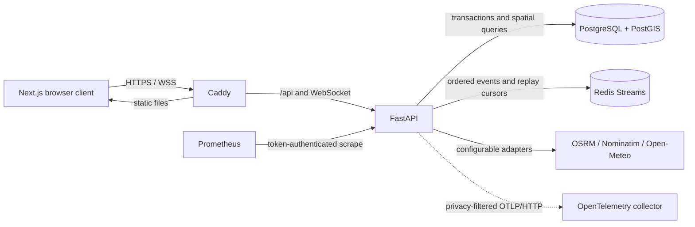

# Architecture

SafeRoute AI is a vendor-neutral route-risk decision-support system. The production path is a browser client served by Caddy, a versioned FastAPI boundary, PostgreSQL/PostGIS as the system of record, and Redis Streams as the replayable event channel. The static GitHub Pages release is a separate portfolio mode: it uses public open providers and clearly labelled deterministic fallbacks, but does not claim that the protected backend is running.

## Runtime boundaries

- `apps/web` owns presentation, in-memory session state, provenance labels, API fallback decisions, and WebSocket reconnection. It never treats a simulated action as a successful protected API mutation.
- `apps/api` owns validation, authentication, RBAC, object ownership, route analysis, incident moderation, trip state, audit records, and event publication.
- `PostgresRepository` owns persistent route, trip, incident, and audit data. PostGIS geography columns use SRID 4326 and GiST indexes.
- Redis Streams are a bounded delivery and replay mechanism, not the system of record. Consumers reconnect with the last stream cursor.
- Provider adapters isolate public routing and weather services. Their failure can activate a labelled deterministic fallback in demonstration mode; production startup still requires PostGIS, Redis, authentication, strong secrets, and an explicit CORS origin.

## Identity and tenant boundary

Access tokens are short-lived JWTs with issuer, audience, expiry, not-before time, and unique IDs. Opaque refresh tokens are hashed at rest, rotated on every use, and revoked on logout. Public registration can create only drivers. Role checks protect fleet, moderation, emergency, and audit functions; trip endpoints additionally enforce owner-or-operator object authorization. Browser credentials remain in memory and are sent to WebSockets in the first frame rather than in URLs.

## Risk decision path

Routes come from configurable OSRM/Nominatim adapters. Each sampled segment receives transparent baseline and incident penalties plus weather factors. Aggregation weights both the average and worst segment so a dangerous section is not hidden by otherwise low-risk geometry. Every response carries factor details, confidence, provider provenance, and a non-guarantee disclaimer. See [risk scoring](risk-scoring.md).

## Failure behavior

| Failure | Production behavior | Portfolio/static behavior |
|---|---|---|
| PostGIS unavailable | Readiness returns 503; traffic should be drained | Not applicable |
| Redis unavailable | Readiness returns 503; realtime delivery is unavailable | Simulation remains local |
| Public route/weather provider unavailable | API uses its configured deterministic fallback and reports provenance | Browser uses labelled public or built-in fallback data |
| WebSocket interruption | Bounded reconnect with cursor replay | Connection status is visible |
| Authentication expiry | One refresh rotation and retry, then signed-out state | Protected actions remain unavailable |

## Key trade-offs

- In-memory browser tokens reduce credential persistence and XSS blast radius, but a page reload requires sign-in. Same-origin deployments can later move refresh rotation to an HttpOnly SameSite cookie.
- Redis Streams cost more memory than pub/sub, but permit bounded replay and multi-replica APIs.
- Deterministic scoring is less flexible than a trained model, but is inspectable and defensible while licensed outcome data is absent.
- Static export makes the portfolio resilient and free to host, but it is not the production backend. Provenance labels prevent that distinction from being hidden.
- Public open providers avoid proprietary lock-in and credentials, but offer no production SLA. URLs are configurable for self-hosted or contracted instances.

## Known limitations

- Included incidents, people, trips, and outcomes are demonstration data and cannot validate real-world safety effectiveness.
- No trained risk model is shipped until a licensed, representative dataset and defensible evaluation protocol exist.
- Public provider routes do not include guaranteed live traffic or emergency-service intelligence.
- Expo background tracking, native notifications, evidence uploads, and real emergency dispatch require separate consent, platform entitlements, retention controls, and security review.
- A public production deployment still requires owner-selected hosting, DNS, off-host encrypted backups, and incident-response ownership.