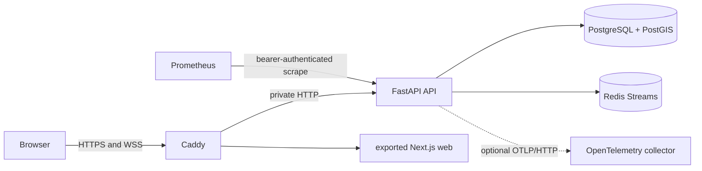

# Vendor-neutral production deployment

The production stack runs on any Linux host with Docker Engine and Compose. It does not require Azure, AWS, Google Cloud, or a proprietary application platform.

## Runtime topology



Only ports 80 and 443 are public. PostgreSQL, Redis, the API container, and the observability network have no host-published ports. Prometheus is optional and binds only to `127.0.0.1` for access through an SSH tunnel.

## Host prerequisites

- A supported Linux distribution with current security updates
- Docker Engine 28 or newer and Docker Compose v2
- A domain with A/AAAA records pointing at the host
- Inbound TCP 80 and TCP/UDP 443; SSH restricted to administrator addresses
- At least 2 CPU cores, 4 GB RAM, and monitored encrypted storage for a small portfolio deployment

## First deployment

1. Copy `.env.production.example` to `.env.production` and set the domain, public HTTPS origin, and an operational email address.
2. Generate secrets once:

   ```sh
   infrastructure/scripts/generate-secrets.sh
   ```

3. Protect the files and keep them out of source control and backups that are not encrypted:

   ```sh
   chmod 700 .secrets
   chmod 0444 .secrets/*
   chmod 600 .env.production
   ```

4. Validate and start the stack:

   ```sh
   docker compose --env-file .env.production -f compose.production.yml config --quiet
   docker compose --env-file .env.production -f compose.production.yml up -d --build --wait
   ```

5. Verify both traffic-management endpoints through TLS:

   ```sh
   curl --fail https://YOUR_DOMAIN/api/v1/health
   curl --fail https://YOUR_DOMAIN/api/v1/ready
   ```

The secret directory is owner-only; its files are read-only so Compose can mount them into fixed unprivileged service users without changing the host directory boundary.

Caddy obtains and renews certificates automatically. The API runs as UID/GID 10001, uses a read-only root filesystem, drops Linux capabilities, loads credentials from Docker secrets, and runs database migrations before accepting traffic. Caddy is restricted to its bind-service capability and a read-only root filesystem.

## Prometheus and traces

Start the optional Prometheus profile with the core stack:

```sh
docker compose --env-file .env.production -f compose.production.yml --profile observability up -d
ssh -L 9090:127.0.0.1:9090 YOUR_HOST
```

Prometheus reads its bearer credential from a Docker secret. `/metrics` is intentionally not routed by Caddy. Set `OTEL_EXPORTER_OTLP_ENDPOINT` to an exact OTLP/HTTP traces endpoint, ending in `/v1/traces`, when an OpenTelemetry collector is available.

## Backups and restore drills

Create and verify a restricted PostgreSQL custom-format backup:

```sh
infrastructure/scripts/backup-postgres.sh
```

Schedule it with systemd or cron and copy completed `.dump` and `.sha256` files to encrypted off-host storage. A backup is not proven until a restore drill succeeds. Restore requires an explicit confirmation value, verifies the checksum and archive, and takes a fresh safety backup first:

```sh
CONFIRM_RESTORE=saferoute infrastructure/scripts/restore-postgres.sh backups/postgres/saferoute-TIMESTAMP.dump
```

Restore only during a maintenance window after stopping API writes. Redis contains a replay buffer rather than the system of record; PostGIS is the authoritative backup target.

## Updates and rollback

Before updating, take a backup and record the current Git commit and image IDs. Pull a reviewed release, rebuild, and wait for readiness. If application code must be rolled back, use the previously recorded commit/images. Database migrations require a migration-specific rollback decision; never blindly downgrade a production database.

## User-owned production decisions

The repository can validate the stack, but a real public deployment still requires the owner to choose or provide:

- a Linux hosting provider and approval for its recurring cost;
- a domain and permission to change its DNS records;
- an off-host encrypted backup destination and retention policy;
- an email address for certificate expiry notices;
- an OpenTelemetry backend, if traces should be retained beyond local logs.
